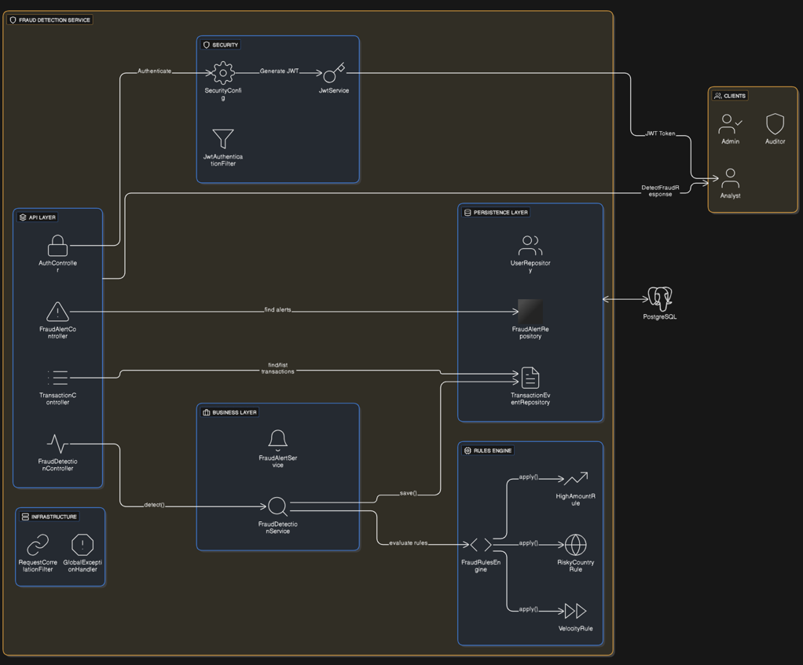
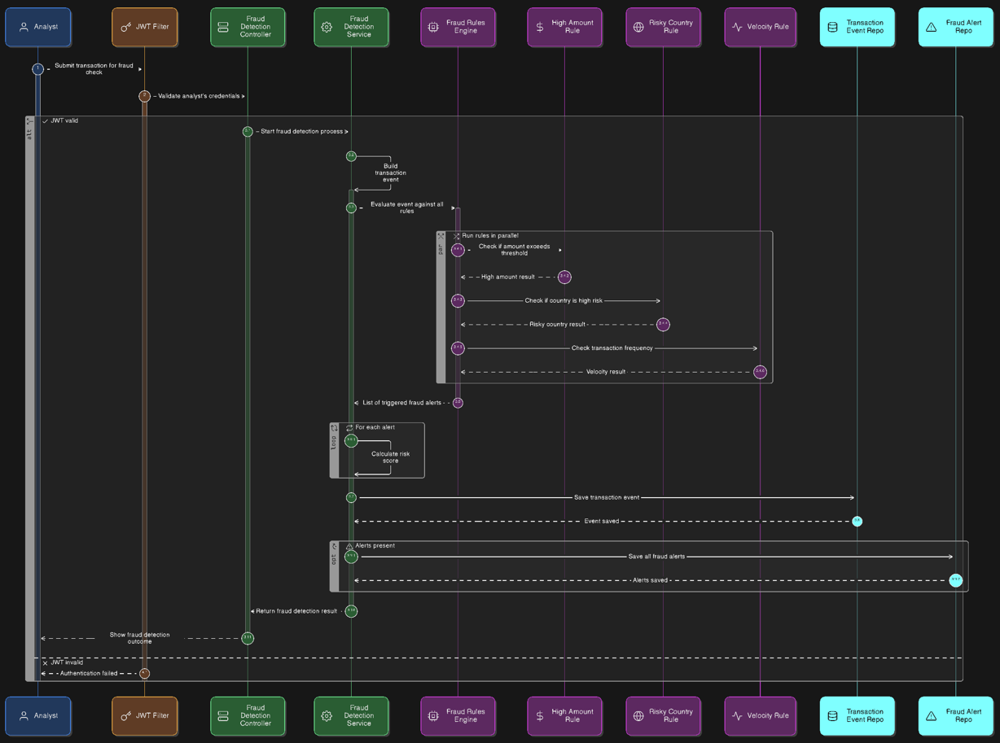

# 🛡️ Fraud Detection Service
Real-time fraud detection microservice built with **Spring Boot 3**, **Java 17**, **JWT Security**, **JUnit 5**, and **Mockito**.  
It evaluates transactions through a pluggable rules engine and returns alerts, risk scores, and detailed responses.

---

# 🚀 Main Features

### ✔ Real-Time Fraud Detection
The service evaluates incoming transactions using multiple business rules:

- **HighAmountRule** – detects transactions with unusually high amounts
- **RiskyCountryRule** – flags transactions originating from high-risk countries
- **VelocityRule** – detects excessive transaction frequency per account

All rules are executed by a central **FraudRulesEngine**, generating fraud alerts and risk scoring.

---

### ✔ Role-Based Security (JWT)
Authentication and authorization are handled using JWT and Spring Security.

Available roles:

| Role Enum | Spring Role | Description |
|-----------|-------------|-------------|
| `ADMIN`   | `ROLE_ADMIN`   | System administration |
| `ANALYST` | `ROLE_ANALYST` | Can detect fraud via `/transactions/detect` |
| `AUDITOR` | `ROLE_AUDITOR` | Can view transactions and alerts |

- Login via: `/api/v1/auth/login`
- Token is issued using HMAC SHA signing
- Requests use: `Authorization: Bearer <token>`

---

### ✔ Centralized Error Handling
All exceptions are handled by **GlobalExceptionHandler**.

| Code | Description | When it happens |
|------|-------------|-----------------|
| **400** | Validation error | Missing or invalid fields in request DTO |
| **401** | Authentication error | Invalid username/password |
| **403** | Authorization error | User has no required role |
| **500** | Internal server error | Unexpected exceptions |

Each error response includes:

- timestamp
- status
- error
- message
- path
- `correlationId` (added by `RequestCorrelationFilter`)

---

### ✔ Correlation ID for Traceability
Every incoming request receives a unique `X-Correlation-Id` header.

- Helps trace requests through logs
- Automatically added if missing

Middleware: `RequestCorrelationFilter`

---

### ✔ Unit Testing (JUnit 5 + Mockito)
The project includes full unit tests for:

- **FraudDetectionService**
- **HighAmountRule**
- **RiskyCountryRule**
- **VelocityRule**
- Application startup test

✔ **14 tests successfully running**  
✔ Verified with Maven Surefire

---

### ✔ API Documentation with Swagger
Auto-generated documentation available at:
```md
http://localhost:8081/swagger-ui.html
```


Includes:

- Authentication
- Fraud Detection
- Transactions
- Alerts
- Query endpoints

---

# 🧱 Project Architecture

```md
src/main/java/com/armando/frauddetection
│
├── api
│   ├── controller        → REST controllers (Auth, Detection, Alerts, Queries)
│   └── controller/dto    → Request/Response DTOs
│
├── config                → Filters, CORS, OpenAPI config, Correlation ID
│
├── domain
│   ├── model             → JPA entities
│   ├── repository        → Spring Data JPA repositories
│   └── service           → Business logic (FraudDetectionService)
│
├── rules                 → Fraud rules + rule engine
│
└── security              → JWT, authentication filter, security config
```
## 🧱 Architecture Diagram



# 🔍 Fraud Detection Flow

flowchart TD

A[Incoming Request: POST /transactions/detect] -> B[JWT Validation & Role Check (ANALYST)]

B -> C[DTO Validation (@Valid)]

C -> D[Convert to TransactionEvent]

D -> E[FraudRulesEngine executes rules]

E ->|Rules triggered| F[Generate Fraud Alerts]

E ->|No rules triggered| G[Flagged = false]

F -> H[Calculate riskScore]

G -> H[RiskScore = 0]

H -> I[Persist TransactionEvent]

I -> J[Return DetectFraudResponse]

## 🧱 Sequence Diagram



# 📡Example Request & Response

POST /api/v1/transactions/detect
```md
{
"transactionId": "TX-200",
"accountId": "ACC-100",
"amount": 4500,
"currency": "USD",
"channel": "WEB",
"ipAddress": "190.10.20.30",
"country": "RU",
"merchantId": "M-999"
}
```
Sample Response
```md
{
"transaction": {
"transactionId": "TX-200",
"flagged": true,
"riskScore": 110,
"flagReason": "High amount | Risky country"
},
"alerts": [
{ "ruleCode": "HighAmountRule", "description": "Amount 4500 exceeds threshold" },
{ "ruleCode": "RiskyCountryRule", "description": "Country RU is high-risk" }
]
}
```

# 🔐 Security

Login Endpoint

POST /api/v1/auth/login

Request
```md
{
"username": "analyst",
"password": "123456"
}
```

Response
```md
{
"token": "xxxx.yyyy.zzzz",
"username": "analyst",
"role": "ROLE_ANALYST"
}
```

# 🔥 Main Endpoints
🔐 Authentication
```md
POST /api/v1/auth/login
```
🧠 Fraud Detection (ANALYST only)
```md
POST /api/v1/transactions/detect
```

📊 Transaction Queries
```md
GET /api/v1/transactions/{id}

GET /api/v1/transactions/list
```

# 🚨 Alerts
```md
GET /api/v1/alerts/{transactionId}
```

# 🧪 Running Tests

Run all unit tests:
```md
mvn test
```
Expected output:
```md
Tests run: 14, Failures: 0, Errors: 0, Skipped: 0
BUILD SUCCESS
```

# ▶️ Running the Project

1. Create PostgreSQL database
```md
CREATE DATABASE frauddb;
```

2. Configure database in application.yml

```md
url: jdbc:postgresql://localhost:5432/frauddb
username: frauduser
password: fraudpass
server.port=8081
```

3. Run the application
```md
mvn spring-boot:run
```

# 🛣 Future Enhancements (Not Implemented Yet)

- Kafka integration for streaming fraud events 
- Redis caching for transaction history 
- Controller-level tests with WebMvcTest 
- JaCoCo code coverage reports 
- Email/Webhook alert notifications

# 🛠️ Tech Stack

| Layer         | Technologies                     |
| ------------- | -------------------------------- |
| Backend       | Java 17, Spring Boot 3.5, Lombok |
| Security      | Spring Security + JWT            |
| Data          | PostgreSQL, JPA/Hibernate        |
| Tests         | JUnit 5, Mockito                 |
| Documentation | Swagger / Springdoc OpenAPI      |
| Monitoring    | Spring Boot Actuator             |


# ✍ **Autor**
**Armando Haro**  
Backend Developer – Java | Spring Boot | Microservices  
GitHub: https://github.com/armandoharo1
